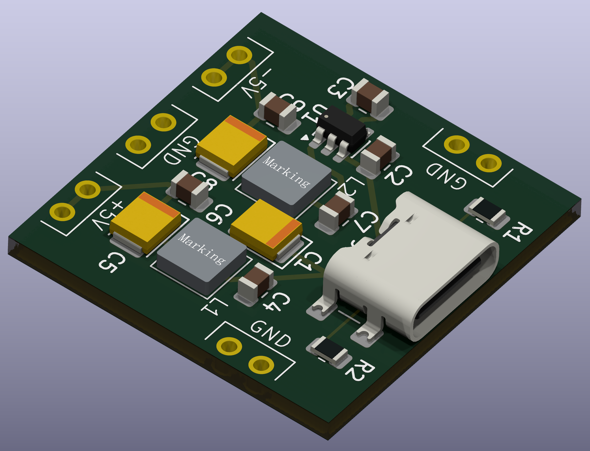
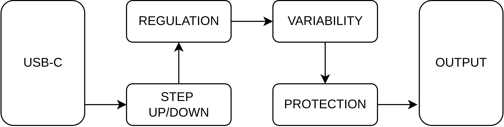

# Simple Bipolar Supply

The simple bipolar supply is a USB-C powered dual channel (positive and negative) power supply. The module is a drop in system for projects requiring a bipolar suppy. The project is designed to be a series of building blocks a tailored supply for any application.

## Gallery

*Revision B of the charge-pump variant rendered in KiCad*

## Features

### Generic
* USB-C powered.
* Dual channel +/- with respect to ground.
* Filtered output.
* Pin pitch designed for breadboard compatibility.
* Pi filtered output.

## Status : Prototype phase
### Issues
* None so far! 🤞

### In The Works
* Initial proof of concept for the charge pump variant of the suppy.
* PCB and parts order on the way for testing RevA.
* Regulated and adjustable output stage for the lower voltage version.

### Roadmap
The long term plan is to develop multiple building blocks for two primary variants of the power supply. The building blocks and whole system are outlined in the system block diagram. Only the first two blocks are implemented in the first revision. Each block in the diagram between USB-C and output can be added and removed as necesary.

*Block diagram convering the project roadmap*

